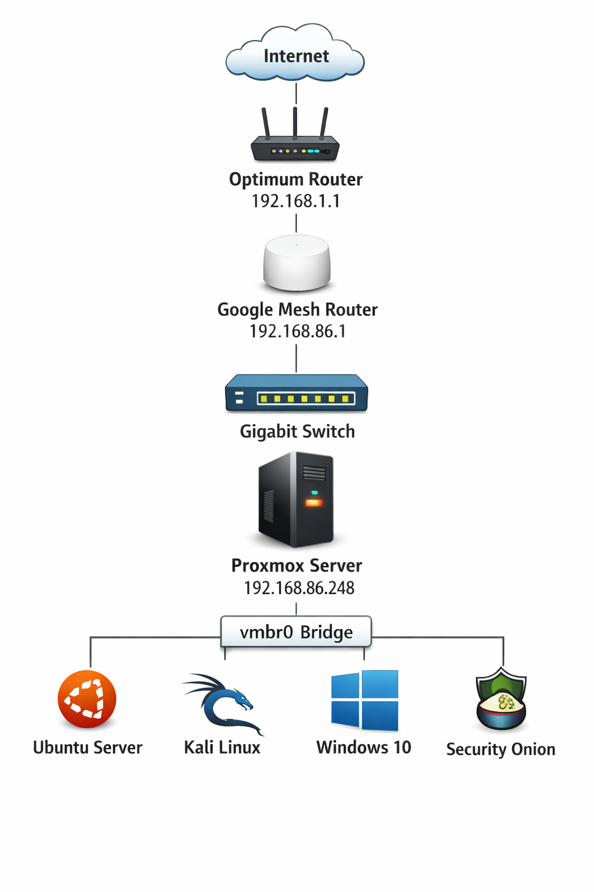

# Home SOC Lab

---

## Lab Architecture

  

This repository documents the design, build, and investigation exercises from my personal cybersecurity home lab.

The goal of this lab is to simulate a small **Security Operations Center (SOC)** environment where attacks can be generated, detected, investigated, and documented using real security tools.

---

## Lab Objectives

* Build a virtual SOC environment using Proxmox
* Monitor endpoint activity using Wazuh SIEM
* Simulate attacks using Kali Linux
* Investigate alerts using SIEM dashboards
* Document findings through incident reports

---

## Current Lab Status

✔ Proxmox VE hypervisor deployed  
✔ Ubuntu Server (target) deployed and configured  
✔ Kali Linux (attacker) deployed  
✔ Wazuh SIEM deployed (all-in-one)  
✔ Wazuh agent installed and connected to Ubuntu  
✔ SSH service exposed for testing  
✔ Brute force attack simulated using Hydra  
✔ Detection validated in Wazuh (1,100+ events)  
✔ Incident report created and documented  

---

## Skills Demonstrated

* SIEM deployment and configuration (Wazuh)
* Endpoint monitoring and log analysis
* Brute force attack simulation (Hydra)
* Network reconnaissance (Nmap)
* SSH authentication log analysis
* MITRE ATT&CK mapping (T1110 – Brute Force)
* Threat detection and investigation workflows
* Proxmox virtualization
* Linux system administration
* Network troubleshooting and configuration
* Incident documentation and reporting

---

## Lab Environment

### Systems

* Kali Linux (Attacker) – 192.168.86.39  
* Ubuntu Server (Target) – 192.168.86.35  
* Wazuh SIEM – 192.168.86.36  

---

## Attack Simulation: SSH Brute Force

A brute force attack was simulated from the Kali attacker machine targeting the Ubuntu server's SSH service.

### Command Used
