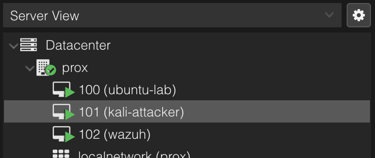
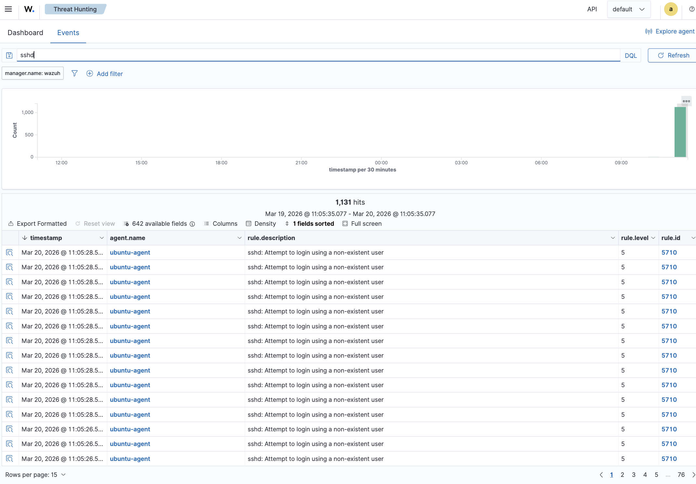
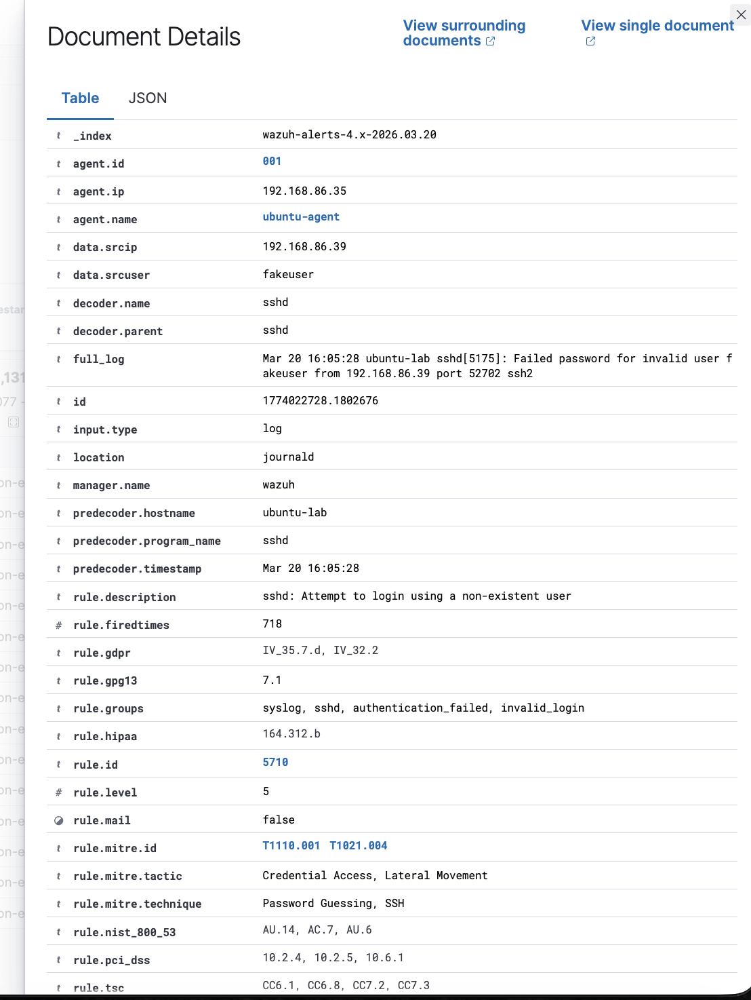
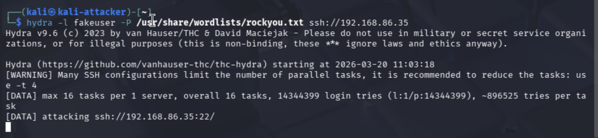

Incident Report: SSH Brute Force Attack Simulation

Date: March 20, 2026
Environment: Home SOC Lab (Proxmox, Wazuh, Kali Linux, Ubuntu Server)
Analyst: Steve Bownds

Summary

A brute force attack targeting SSH (port 22) was simulated using Hydra from an attacker machine (Kali Linux). The target system (Ubuntu Server) was monitored by a Wazuh SIEM agent, which successfully detected and logged repeated authentication failures.

The attack generated over 1,100 failed login attempts within a short time window, indicating automated credential guessing activity.

Systems Involved

Attacker: Kali Linux (192.168.86.39)

Target: Ubuntu Server (192.168.86.35)

SIEM: Wazuh Manager with Ubuntu Agent

Attack Details

Tool Used: Hydra

Command Executed:

hydra -l fakeuser -P /usr/share/wordlists/rockyou.txt ssh://192.168.86.35

Attack Type: Brute Force (Credential Guessing)

Target Service: SSH (port 22)

Detection & Evidence

Wazuh generated over 1,100 alerts with the following characteristics:

Rule ID: 5710

Rule Description: sshd: Attempt to login using a non-existent user

Log Source: /var/log/auth.log

Decoder: sshd

Key Indicators

Repeated failed login attempts

High frequency of authentication failures

Invalid username attempts (fakeuser)

Consistent source IP: 192.168.86.39

MITRE ATT&CK Mapping

Technique: T1110 – Brute Force

Sub-technique: T1110.001 – Password Guessing

Timeline
Time	Event
11:03	Hydra attack initiated from Kali
11:05	Wazuh begins logging SSH failures
11:05+	Rapid spike in authentication failure events
Impact Assessment

No successful login occurred

No system compromise detected

Activity classified as reconnaissance or initial access attempt

Recommendations

Disable password-based SSH authentication

Implement SSH key-based authentication

Install and configure Fail2Ban

Limit login attempts via PAM

Monitor and alert on repeated authentication failures

Conclusion

The lab successfully demonstrated detection of a brute force attack using Wazuh SIEM. This validates that the monitoring pipeline is functioning and capable of identifying suspicious authentication activity.

## Screenshots

### Lab Environment (Proxmox)

### SSH Brute Force Detection in Wazuh
Shows repeated failed login attempts detected by Wazuh.

### Event Details (Source IP and Rule Analysis)
Shows attacker IP (192.168.86.39), rule ID, and log details.

### Hydra Attack Simulation from Kali
Shows active brute force attack targeting SSH.

